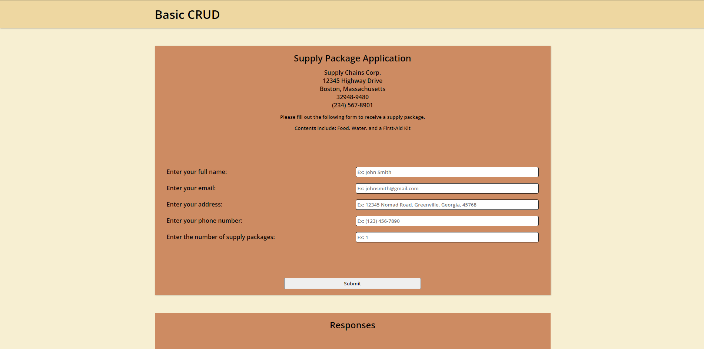

# Basic CRUD

## Overview
Basic CRUD application demonstrated through a simple form template.

## Video
Check out a video of the application [here](https://youtu.be/GCnkCVpzLcI).

## Screenshots


## Description
View the form design without the full functionality [here](https://miknsj.github.io/basic-crud/templates/index.html).

## Notes
Adaptive/Responsive Design was not enforced. For the best viewing purposes, please opt for a device with  a screen size of at least 1100px and a
browser other than Safari.

## Contents
- ```screenshots```: contains screenshots of the website
- ```video```: contains a video of the website
- ```README.md```: contains description of the repository
- ```.gitignore```: hides files to the remote repository
- ```static```: contains styles.css
- ```templates```: contains html files
- ```main.py```: contains back-end support
- ```requirements.txt```: contains packages to install

## Setup
- Clone/copy the repository to your working environment.
- Visit/read the FastAPI documentation to install/setup a virtual environment and FastAPI.
- Activate the virtual environment before installing packages.
- Installing uvicorn is optional, so you may use the default live server provided by FastAPI.
- If you are using uvicorn, then execute the command ```uvicorn main:app --reload``` to run the website. Otherwise, execute the
  command ```fastapi dev main.py``` for the default live server.
- In the command prompt or your terminal will provide a local host website where you can access the full functionality
  of the website there.
- Execute the command ```deactivate``` to close out of the virtual environment when finished.

## Versions
- The default version will have a branch labeled as ```NoSQL``` which uses a temporary database of a Python list.
- The modified version will have a branch labeled as ```SQL``` or refer to ```master``` which uses a SQL database. (TBD)

## Contributions
Tools

- WSL2 (Ubuntu 11.4.0)
- Vim + coc.nvim
- npm + live-server
- FastAPI + uvicorn

## Changelog
- Website Version 1.0 established on August 2024

## License
Established on August 2024 by MIKNSJ.
